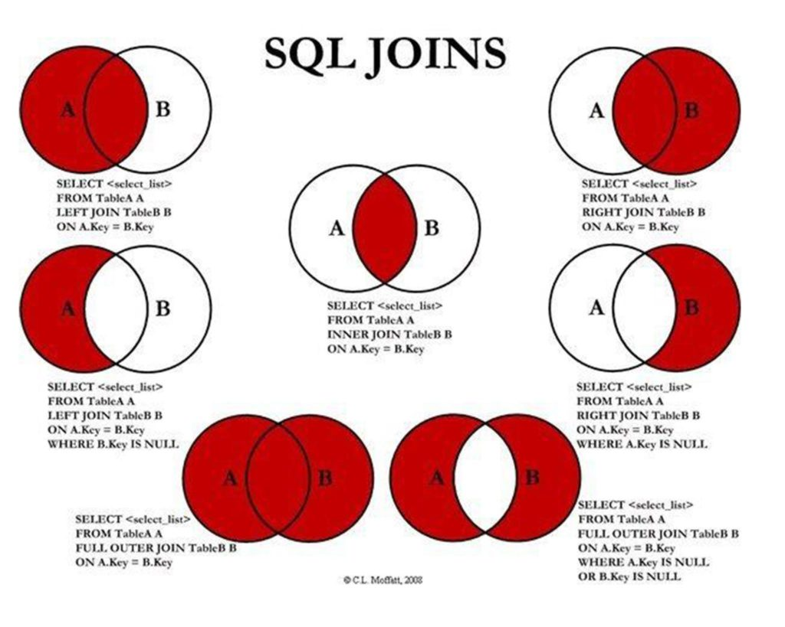

Entre duas tabelas/conjuntos o inner seria os dados relacionados entre si.

INNER -> tudo que está dentro
OUTER -> Oque está fora.

Left Join
O resultado de INNER JOIN, mas tudo que está a esquerda

Right Join
O resultado de INNER JOIN, mas tudo que está a direita

